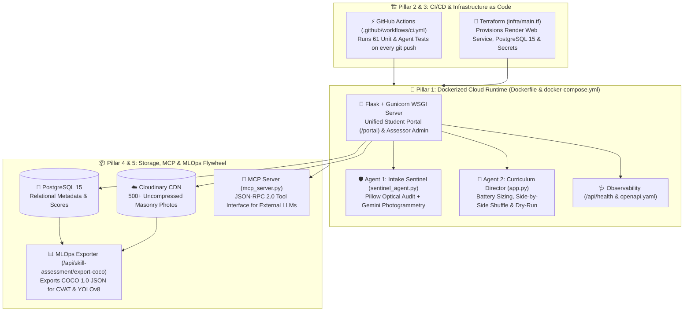

# 🏆 Global Wall Inspector — Master Interview & System Architecture Guide

This guide breaks down the **5-Pillar Modern AI & Cloud Engineering Stack** implemented in this repository so you can speak to every layer with hands-on authority in technical, product, or leadership interviews.

---

## 🗺️ High-Level System Architecture



---

## 🎤 The 5 Pillars: Interview Questions & Your "Gold Standard" Answers

### Pillar 1: Docker & Containerization ([`Dockerfile`](file:///Users/barrysisk/Gemini_Start_Code/wall_inspector/Dockerfile), [`docker-compose.yml`](file:///Users/barrysisk/Gemini_Start_Code/wall_inspector/docker-compose.yml))

* **Why We Used It**:
  Earlier in development, our **Intake Sentinel Agent** worked on macOS (which already had `Pillow` installed) but failed when deployed to a Linux cloud server (`ModuleNotFoundError: No module named 'PIL'`). Docker eliminates the *"Works on My Machine"* problem by sealing the exact OS (`python:3.11-slim`), native C image libraries (`libjpeg62-turbo`), Python packages, and `Gunicorn` server inside an immutable container.
* **Key Engineering Best Practices in Our `Dockerfile` you can mention**:
  1. **Layer Caching**: We copy and install `requirements.txt` *before* copying `app.py`, so Docker caches the libraries and rebuilds in 2 seconds when code changes.
  2. **Non-Root Security (`appuser`)**: We run the container as a dedicated non-root user (`UID 1001`) so even if a web request is compromised, it has no root access.
  3. **Stateless Compute + Externalized State**: Because containers are ephemeral (wiped on restart), we store all 500 uncompressed masonry images in **Cloudinary CDN** and relational data in **PostgreSQL 15**.
  4. **Built-in `HEALTHCHECK`**: Docker automatically pings `http://localhost:8000/api/health` every 30 seconds to verify the app and database are alive.

---

### Pillar 2: Terraform — Infrastructure as Code ([`infra/main.tf`](file:///Users/barrysisk/Gemini_Start_Code/wall_inspector/infra/main.tf), [`infra/variables.tf`](file:///Users/barrysisk/Gemini_Start_Code/wall_inspector/infra/variables.tf))

* **Why We Used It**:
  Setting up cloud servers by clicking buttons in a web dashboard ("ClickOps") is slow, unrepeatable, and prone to human error. Terraform codifies our cloud infrastructure into declarative `.tf` files.
* **What Our `infra/main.tf` Does**:
  1. Provisions a managed **PostgreSQL 15** database (`render_postgres.wall_inspector_db`).
  2. Provisions the **Dockerized Web Service** (`render_web_service.wall_inspector_app`) pointing to `BBSISK/wall_inspector`.
  3. Automatically injects the database's internal connection string into the web service's `DATABASE_URL` environment variable, alongside sensitive secrets (`CLOUDINARY_URL`, `GEMINI_API_KEY`).
* **Interview Soundbite**:
  > *"While Docker defines what runs **inside** the container, Terraform defines the **cloud infrastructure** around it—provisioning the managed PostgreSQL 15 instance, networking, and secret bindings so we can spin up a staging or client environment in one command (`terraform apply`)."*

---

### Pillar 3: GitHub Actions CI/CD ([`.github/workflows/ci.yml`](file:///Users/barrysisk/Gemini_Start_Code/wall_inspector/.github/workflows/ci.yml))

* **Why We Used It**:
  To prevent broken code from ever reaching production.
* **What Happens on Every `git push`**:
  1. GitHub automatically boots a fresh Ubuntu Linux cloud machine.
  2. Installs Python 3.11 and `requirements.txt`.
  3. Runs all **61 automated unit tests** covering the Unified Student Portal (`/portal`), the **Intake Sentinel Agent**, the **Curriculum Director Agent** (anti-collusion randomization & dry-run mode), and the **COCO MLOps Exporter**.
  4. Runs `python mcp_server.py --self-test` to verify all 4 MCP agent tools respond accurately.

---

### Pillar 4: Model Context Protocol — MCP Server ([`mcp_server.py`](file:///Users/barrysisk/Gemini_Start_Code/wall_inspector/mcp_server.py))

* **Why We Used It**:
  **MCP (Model Context Protocol)** is the universal open standard in 2026 for connecting AI assistants (Claude, Gemini, Cursor) to domain-specific tools and databases over JSON-RPC 2.0.
* **What Our `mcp_server.py` Exposes**:
  1. `sentinel_evaluate_image` — Lets any external AI agent run optical quality and sharpness checks on a wall photo.
  2. `curriculum_cohort_intelligence` — Lets an AI assistant query live student pass rates and identify which masonry defect categories the class is struggling with.
  3. `list_skill_specimens` — Queries the active masonry catalog by difficulty tier.
  4. `export_coco_dataset_stats` — Reports MLOps training dataset readiness.

---

### Pillar 5: MLOps Data Flywheel & CVAT / YOLOv8 Bridge ([`/api/skill-assessment/export-coco`](file:///Users/barrysisk/Gemini_Start_Code/wall_inspector/app.py#L7921-L8052))

* **Why We Used It**:
  As assessors upload **500 uncompressed masonry images** to Cloudinary and students drop thousands of diagnostic pins in `/portal`, the platform naturally builds a massive labeled Computer Vision dataset.
* **How It Works**:
  - Clicking **`[ 📦 Export COCO / CVAT ]`** in `/skill-assessment/admin` hits `/api/skill-assessment/export-coco?download=1&include_student_consensus=1`.
  - It exports a standard **Microsoft COCO 1.0 JSON** dataset containing all Cloudinary image URLs, defect categories, expert ground-truth bounding boxes (`[x, y, width, height]`), and crowdsourced student consensus pins.
  - This JSON file can be imported directly into **CVAT** or used to fine-tune a custom **YOLOv8-Seg** masonry defect detector.

---

## 🛠️ Quick Reference Commands

```bash
# 1. Run all 61 Unit, Agent & DevOps Tests
python3 -m unittest discover -s . -p "test_*.py" -v

# 2. Run the Model Context Protocol (MCP) Server Self-Test
python3 mcp_server.py --self-test

# 3. Start the Full Stack Locally in Docker (Web + PostgreSQL 15)
docker compose up --build

# 4. Validate Terraform Infrastructure Configuration
cd infra && terraform init && terraform validate
```
