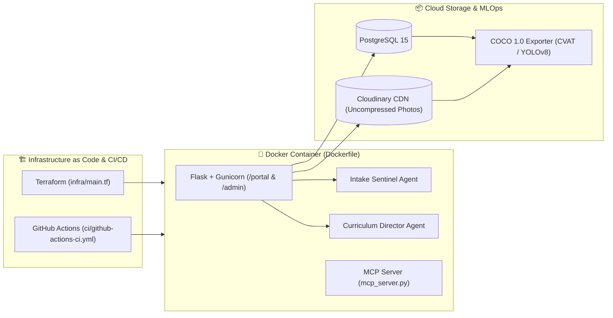

# 🏛️ Global Wall Inspector — AI Masonry Diagnostic & Skills Certification Platform

**Global Wall Inspector** is a clinical skills-assessment and certification platform built for civil engineering, heritage conservation, and masonry construction students and assessors. Traditional masonry training relies on static textbook photos or inconsistent field walks where instructors cannot objectively measure whether a student is looking at the right defect. This platform solves that by turning high-resolution, uncompressed masonry photographs into interactive diagnostic workstations: students inspect walls using a zoom loupe, drop spatial defect pins (`step_cracking`, `lime_washout`, `spalling`, `root_jacking`), classify structural severity, and prescribe conservation remedies—which are then graded in real time against expert ground-truth bounding boxes. Behind the scenes, two autonomous AI agents (**Intake Sentinel** and **Curriculum Director**) audit incoming photographic quality, generate side-by-side randomized exam batteries with unscored practice dry-runs, and export labeled datasets in **Microsoft COCO 1.0 JSON** format for downstream Computer Vision (`CVAT` / `YOLOv8`) training.

---

## 🚀 Key Capabilities

* **Unified KISS Student Portal (`/portal`)**: Single-entry-point candidate hub featuring 10-second cohort check-in, an adaptive 10-question exam battery hero launcher, unscored practice dry-run tutorials, and a live CPD Competency Radar & Skills Passport.
* **Agent 1 — Intake Sentinel (`sentinel_agent.py`)**: Evaluates newly uploaded field photographs across 4 photogrammetric pillars (90° orthogonal plane, diffuse illumination, course framing, and Laplacian focus sharpness) with a non-blocking *Progress Under Advisement* override.
* **Agent 2 — Curriculum Director (`app.py`)**: Allows assessors to configure custom exam battery sizes (default 10), dynamically shuffles question order per candidate to prevent side-by-side classroom collusion, and identifies cohort-wide diagnostic blind spots.
* **Model Context Protocol Server (`mcp_server.py`)**: Exposes the platform's domain agents (`sentinel_evaluate_image`, `curriculum_cohort_intelligence`, `list_skill_specimens`, `export_coco_dataset_stats`) over JSON-RPC 2.0 for external LLM hosts (Claude, Gemini, Cursor).
* **MLOps COCO 1.0 Dataset Exporter (`/api/skill-assessment/export-coco`)**: Exports full-resolution Cloudinary image links, expert ground-truth bounding boxes, and crowdsourced student consensus pins into standard COCO JSON for **CVAT** and **YOLOv8-Seg** pipelines.

---

## 🏗️ System & DevOps Architecture



### 📂 Key Repository Files (Relative Links)

* **Application & AI Agents**: [`app.py`](app.py) | [`sentinel_agent.py`](sentinel_agent.py) | [`models.py`](models.py)
* **Model Context Protocol (MCP) Server**: [`mcp_server.py`](mcp_server.py)
* **Containerization**: [`Dockerfile`](Dockerfile) | [`docker-compose.yml`](docker-compose.yml) | [`.dockerignore`](.dockerignore)
* **Terraform Infrastructure as Code**: [`infra/main.tf`](infra/main.tf) | [`infra/variables.tf`](infra/variables.tf) | [`infra/outputs.tf`](infra/outputs.tf)
* **API Contract & CI Pipeline**: [`openapi.yaml`](openapi.yaml) | [`ci/github-actions-ci.yml`](ci/github-actions-ci.yml)
* **Interview & Architecture Deep-Dive**: [`INTERVIEW_ARCHITECTURE_GUIDE.md`](INTERVIEW_ARCHITECTURE_GUIDE.md)

---

## 🛠️ Quick Start & Verification

### 1. Run with Docker Compose (Full Stack: Web + PostgreSQL 15)
```bash
docker compose up --build
# Application runs at http://localhost:8000/portal
# Container health telemetry at http://localhost:8000/api/health
```

### 2. Run the 60+ Automated Unit & Agent Tests
```bash
python3 -m unittest discover -s . -p "test_*.py" -v
python3 mcp_server.py --self-test
```

### 3. Security & Environment Variables (Production)
All credentials and cloud endpoints are injected strictly via environment variables (never hardcoded):
* `DATABASE_URL` — Managed PostgreSQL 15 connection string
* `CLOUDINARY_URL` — Cloudinary CDN key for uncompressed masonry photography
* `GEMINI_API_KEY` — Google Gemini Vision API key for AI defect suggestions
* `ADMIN_PASSWORD` & `ADMIN_PIN` — Assessor workstation credentials
* `SECRET_KEY` — Cryptographic session signing key
