# 26 Student Assessment Worked Examples Catalog
**Global Wall Inspector — Master Diagnostic Test Bank**

> [!NOTE]
> This catalog contains **26 complete worked specimens** engineered for testing student masonry pathology competence. Each entry specifies authentic imagery, architectural context, clinical defect diagnosis, failure mechanics, tolerances, student assessment tasks, and Euro (€) benchmark rates.
> 
> A standalone interactive viewer is also available at: [`worked_examples_catalog.html`](templates/worked_examples_catalog.html)

---

## Catalog Overview

| # | Specimen Title | Wall Archetype | Primary Defect Flaw | Severity | Industry Standard | Euro (€) Remedial Rate |
| :-: | :--- | :--- | :--- | :-: | :--- | :--- |
| **01** | Victorian Red Brick Cavity | Brick Cavity | Crystalline Salt Efflorescence | Moderate | BRE Digest 245 / RICS CR2 | €45–€75 / m |
| **02** | Industrial Fired Brick Pier | Brick Cavity | Cryo-Hydraulic Frost Spalling | Critical | BS EN 771-1 / BRE 251 | €280–€550 / m² |
| **03** | Edwardian Flank Wall | Brick Cavity | Stepped Settlement Shear Crack | Critical | BRE Digest 251 (Cat 3) | €85–€160 / m |
| **04** | Commercial Gable Brickwork | Brick Cavity | Thermal Movement Fracture | Moderate | BS 5628 / BRE 361 | €85–€160 / m |
| **05** | 18th-C. Coursed Lime Rubble | Historic Lime | Deep Bed Joint Lime Washout | Critical | SPAB Note 1 / Historic Eng | €45–€75 / m |
| **06** | Uncoursed Rubble: Continuous Joints | Stone Rubble | Continuous Vertical Joint Shear | Critical | IS 1597-1 / EN 1996-1-1 | €85–€160 / m |
| **07** | Fieldstone Rubble: Lime Run-off | Stone Rubble | Severe Lime Run-off & Calcite Crust | Critical | BS 8221-1 / UltraTech | €55–€95 / m |
| **08** | Stone Boundary: Missing Ties | Stone Rubble | Absence of Through-Stones | Critical | IS 1597-1 / BRE GBG 14 | €280–€550 / m² |
| **09** | Georgian Ashlar Limestone | Ashlar Stone | Bedding Plane Exfoliation | Critical | Historic England / BS 8298 | €280–€550 / m² |
| **10** | Sedimentary Stone: Face-Bedding | Ashlar Stone | Face-Bedding Laminae Delamination | Critical | IS 1124 / BS 8298 | €280–€550 / m² |
| **11** | Exposed Porous Stone: Frost Attack | Ashlar Stone | Cryo-Spalling & Ice Wedging | Critical | EN 12371 / IS 1121 | €280–€550 / m² |
| **12** | Traditional Dry Stone Wall | Dry Stone | Coping Capstone Loss | Moderate | DSWA Codes / Heritage Council | €50–€90 / m |
| **13** | Double-Faced Field Wall | Dry Stone | Out-of-Plumb Lateral Bulge | Critical | DSWA Standards / RICS CR3 | €220–€480 / m |
| **14** | Aran Karst Limestone Wall | Dry Stone | Foundation Settlement / Creep | Moderate | Heritage Council / DSWA | €220–€480 / m |
| **15** | Mountain Pasture Boundary | Dry Stone | Total Structural Shear Breach | Critical | DSWA Master / RICS CR3 | €280–€550 / m² |
| **16** | Highland Retaining Dyke | Dry Stone | Surcharge & Inward Batter Loss | Critical | CIRIA C760 / DSWA | €350–€600 / m |
| **17** | Roadside Granite Retaining | Retaining Wall | Hydrostatic Bulge & Weep Block | Critical | CIRIA C760 / Eurocode 7 | €65–€110 / stn |
| **18** | Vernacular Cob Cottage | Cob Earth | Basal Splash Moisture Undercut | Critical | Historic England / SPAB | €280–€550 / m² |
| **19** | Knapped Flint Facade | Flint Knapped | Flint Unseating & Matrix Loss | Moderate | SPAB Flint Note / Historic Eng | €55–€95 / m |
| **20** | Modular Blockwork (CMU) Framing | Concrete Block | Movement Joint Omission & Shear | Moderate | Eurocode 6 / IS 2185 | €45–€80 / m |
| **21** | Historic Sandstone: Contour Scaling | Ashlar Stone | Contour Scaling Shearing | Critical | Historic England / BS 8298 | €320–€620 / m² |
| **22** | Sheltered Limestone: Gypsum Crust | Ashlar Stone | Black Gypsum Crust & Cavitation | Critical | BS 8221-1 / Historic Eng | €180–€380 / m |
| **23** | Rubble Wall: Ribbon Pointing | Historic Lime | Ribbon Pointing Moisture Trap | Critical | SPAB Note / Historic Eng | €65–€110 / m |
| **24** | Historic Masonry: Cryptogams | Historic Lime | Oxalic Acid Etching & Moss Sponge | Moderate | Historic England / BS 8221-1 | €35–€65 / m² |
| **25** | Faunal Biodeterioration: Bees & Guano | Historic Lime | Mason Bee Boreholes & Guano Pitting | Moderate | BRE GBG 14 / Historic Eng | €45–€85 / m |
| **26** | Victorian Plinth: Synthetic Coating | Ashlar Stone | Impermeable Sealer Spalling | Critical | BS 8221-2 / BRE Digest 245 | €95–€210 / m² |

---

## 1. Brickwork & Cavity Construction (Specimens 01 – 04)

### Specimen 01: Victorian Red Brick Cavity Wall
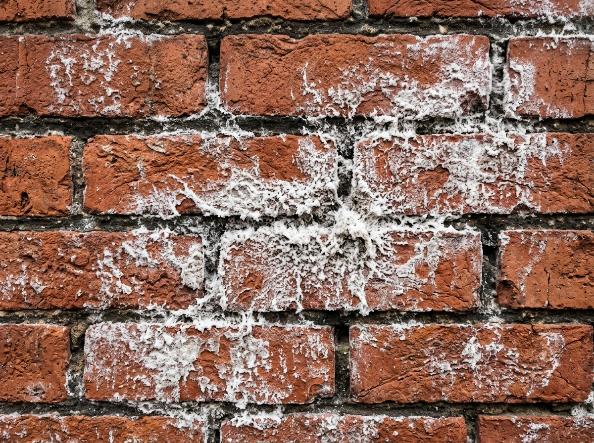

- **Archetype**: Brick Cavity Masonry (Load-bearing Envelope)
- **Location & Material**: Manchester, UK — Fired Carboniferous Coal Measures mudstone brickwork.
- **Flaw Classification**: **Crystalline Salt Leaching (Efflorescence & Crypto-efflorescence)** `[Moderate Risk]`
- **Clinical Pathology & Mechanics**: Groundwater and driven rain migrate through porous brick units via capillary suction. Upon surface evaporation, dissolved calcium and sodium sulfates crystallize, creating expansive sub-surface pressure that powders mortar arrises and leaves prominent white crystalline crusts.
- **Tolerances**: Surface powdering depth `<3mm`; joint recession `<8mm`.
- **Remedial Action**: Dry-brushing surface salts (strictly avoiding pressure washing which drives salts back into the core); tracing and eliminating the moisture ingress source; repointing weathered bed joints with vapor-permeable hydraulic lime mortar (NHL 3.5).
- **Euro (€) Benchmark Rate**: **€45 – €75 / linear meter**
- **Student Assessment Task**:
  - *Task*: Delineate the boundary of active salt leaching.
  - *Target Coordinates*: `[x_min: 0.18, y_min: 0.20, x_max: 0.82, y_max: 0.80]`
  - *Question*: Identify the driving moisture vector and justify why Portland cement pointing must be avoided.
- **Industry Citations**: **BRE Digest 245** (*Rising damp in walls*) &bull; **RICS Condition Rating 2**

---

### Specimen 02: Industrial Fired Brick Pier
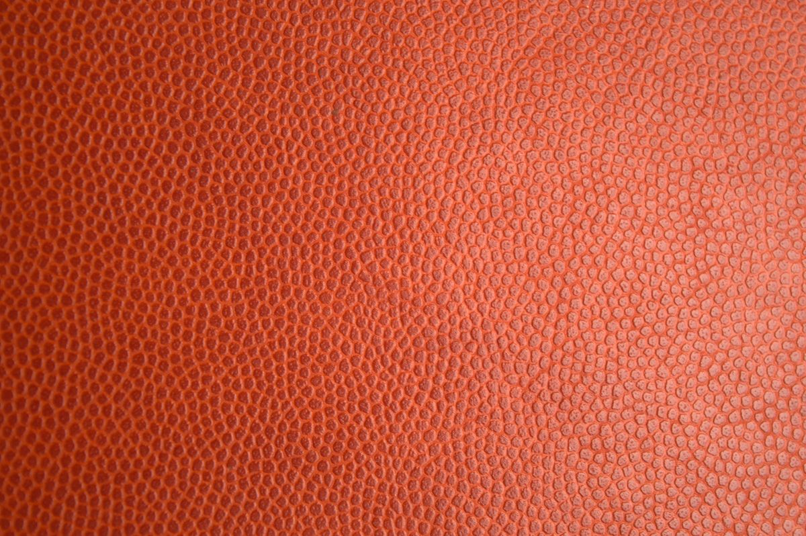

- **Archetype**: Brick Cavity / Solid Fired Brick Pier (Load-bearing)
- **Location & Material**: Birmingham, UK — Low-temperature kiln fired Victorian common bricks.
- **Flaw Classification**: **Severe Cryo-Hydraulic Frost Spalling (Blown Brick Faces)** `[Critical Risk]`
- **Clinical Pathology & Mechanics**: Bricks with low vitrification have high open porosity (>18%). Water trapped within pore structures expands by 9% upon freezing. The resulting hydraulic pressure exceeds the tensile yield strength of the fired clay skin, shearing off the outer face shells and exposing the friable core.
- **Tolerances**: Critical threshold exceeded when spall depth `>15mm` or unit bearing area loss `>10%`.
- **Remedial Action**: Carefully stitch-drill and stitch out damaged units without disturbing adjacent bed courses; piece in frost-resistant (Class F2) handmade matching bricks bedded in NHL 3.5 lime mortar.
- **Euro (€) Benchmark Rate**: **€280 – €550 / square meter localized rebuild**
- **Student Assessment Task**:
  - *Task*: Place bounding reticles over spalled bricks exhibiting face loss.
  - *Target Coordinates*: `[x_min: 0.22, y_min: 0.28, x_max: 0.78, y_max: 0.78]`
  - *Question*: Differentiate between mechanical frost bursting and chemical subflorescence spall.
- **Industry Citations**: **BS EN 771-1** (*Clay masonry units*) &bull; **BRE Digest 251** &bull; **RICS CR3**

---

### Specimen 03: Edwardian Semi-Detached Flank Wall

- **Archetype**: Brick Cavity Masonry (Flank Load-bearing Wythe)
- **Location & Material**: South London, UK — London Stock clay brickwork over London Clay subsoil.
- **Flaw Classification**: **Diagonal Stepped Settlement Shear Fracture** `[Critical Risk]`
- **Clinical Pathology & Mechanics**: Seasonal desiccation of shrinkable subsoil beneath shallow strip footings causes foundation settlement at the wall corner. Differential settlement generates diagonal tension stresses; failure steps through the weakest plane (the mortar bed and perpend joints).
- **Tolerances**: Crack aperture `3.5mm – 6.0mm` (Category 3 structural damage per BRE Digest 251).
- **Remedial Action**: Install calibrated tell-tale optical gauges to confirm movement has ceased; rake out bed joints 500mm past crack zone; install pairs of 6mm helical stainless steel reinforcing ties (316 grade) embedded in thixotropic cementitious grout at 450mm vertical centers.
- **Euro (€) Benchmark Rate**: **€85 – €160 / linear meter helical stitching**
- **Student Assessment Task**:
  - *Task*: Mark the diagonal fault line and measure maximum crack aperture.
  - *Target Coordinates*: `[x_min: 0.30, y_min: 0.15, x_max: 0.75, y_max: 0.85]`
  - *Question*: Classify the damage category under BRE Digest 251 and recommend underpinning vs stitching criteria.
- **Industry Citations**: **BRE Digest 251** (*Assessment of damage in low-rise buildings*) &bull; **RICS Level 3**

---

### Specimen 04: Commercial Gable Brickwork
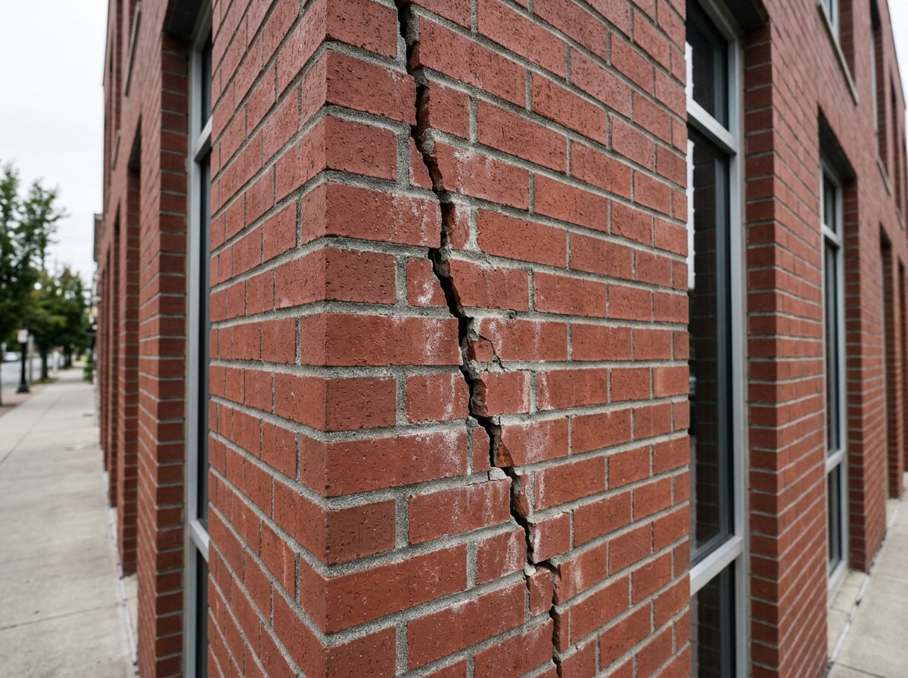

- **Archetype**: Brick Cavity Masonry (Unrestrained Gable Envelope)
- **Location & Material**: Leeds, UK — Modern wirecut extruded brickwork.
- **Flaw Classification**: **Vertical Thermal Expansion Movement Fissure** `[Moderate Risk]`
- **Clinical Pathology & Mechanics**: A continuous 16-meter brick panel built without vertical movement joints. Summer solar radiation causes thermal expansion; restrained return corners force vertical shear splitting 600mm from the building corner.
- **Tolerances**: Movement joint spacing must not exceed `12m` in clay brickwork; crack width `1.5mm – 3.0mm`.
- **Remedial Action**: Diamond saw-cut a continuous 10mm vertical expansion movement joint through the outer wythe; install compressible backing foam rod and seal with UV-stable polysulfide elastomeric sealant.
- **Euro (€) Benchmark Rate**: **€85 – €160 / linear meter**
- **Student Assessment Task**:
  - *Task*: Distinguish this vertical thermal movement crack from foundation subsidence.
  - *Target Coordinates*: `[x_min: 0.45, y_min: 0.10, x_max: 0.80, y_max: 0.90]`
  - *Question*: State the maximum allowable movement joint spacing under BS 5628 for fired clay brickwork.
- **Industry Citations**: **BS 5628** (*Code of practice for use of masonry*) &bull; **BRE Digest 361**

---

## 2. Historic Stone Rubble Masonry (Specimens 05 – 08)

### Specimen 05: 18th-Century Coursed Lime Rubble
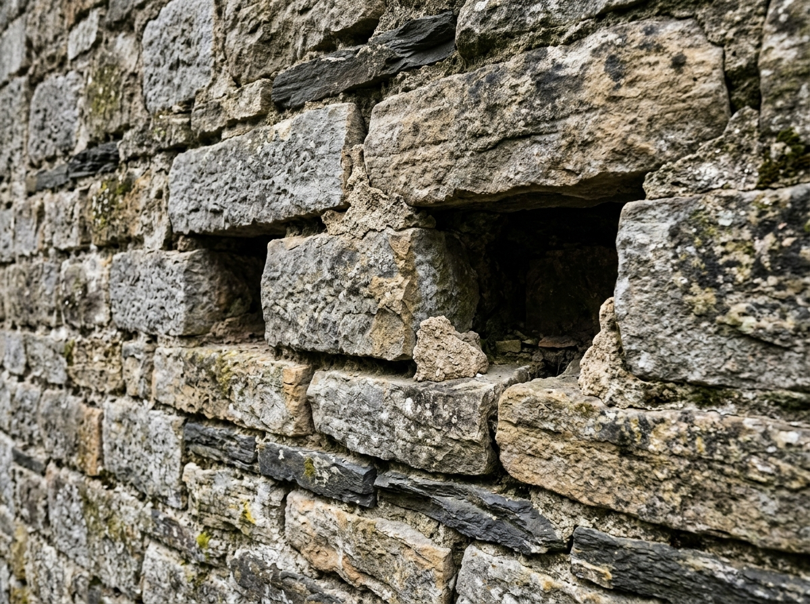

- **Archetype**: Historic Lime Mortar (Coursed Sandstone Rubble)
- **Location & Material**: Wicklow, Ireland — Calcareous Sandstone bedded in hydraulic lime (NHL 2.0).
- **Flaw Classification**: **Deep Bed Joint Lime Binder Washout** `[Critical Risk]`
- **Clinical Pathology & Mechanics**: Exposure to prevailing south-westerly Atlantic gales has dissolved free calcium hydroxide. Mortar has washed out to 35mm–50mm depth, causing stone units to rest point-to-point on edge arrises without uniform bedding.
- **Tolerances**: Joint recession depth `<25mm` max allowable before structural intervention.
- **Remedial Action**: Rake joints back to sound mortar or twice joint width; flush with clean water; repoint flush with moderately hydraulic lime mortar (NHL 3.5, 1:2.5 sharp well-graded sand) using traditional finger trowel and churn brush tamping.
- **Euro (€) Benchmark Rate**: **€45 – €75 / linear meter**
- **Student Assessment Task**:
  - *Task*: Pinpoint zones where joint recession exceeds 25mm depth.
  - *Target Coordinates*: `[x_min: 0.20, y_min: 0.30, x_max: 0.80, y_max: 0.80]`
  - *Question*: Prescribe the exact sand aggregate gradation and explain why Portland cement repointing causes spalling of sandstone arrises.
- **Industry Citations**: **SPAB Technical Advice Note 1** &bull; **Historic England Mortars & Renders**

---

### Specimen 06: Uncoursed Rubble: Continuous Vertical Joint Shear
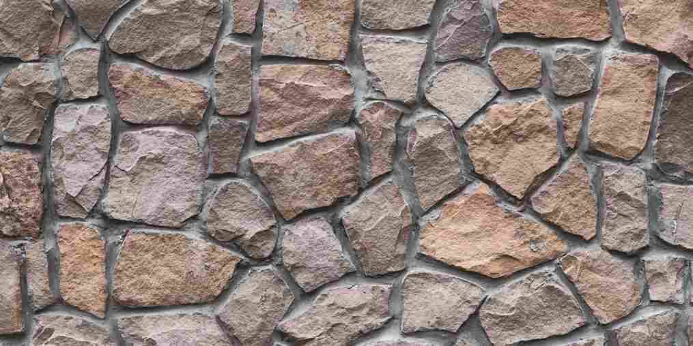

- **Archetype**: Stone Rubble Masonry (Random Rubble Wall)
- **Location & Material**: Rajasthan, India / International — Dressed and uncoursed stone rubble bedded in lime mortar.
- **Flaw Classification**: **Continuous Vertical Joint Alignment & Shear Plane Formation** `[Critical Risk]`
- **Clinical Pathology & Mechanics**: Uncoursed stone rubble walling constructed without bond staggering. Multiple vertical joints align directly across consecutive courses, creating a continuous structural cleavage plane, accompanied by oversized mortar beds (>25mm).
- **Tolerances**: Perpend joints must be staggered by at least `50mm` or 1/3 stone height; maximum joint width `25mm`.
- **Remedial Action**: Rake unbonded joints to 25mm depth; insert helical stainless steel stitch ties across the vertical shear plane; point flush with breathable NHL 3.5 mortar.
- **Euro (€) Benchmark Rate**: **€85 – €160 / linear meter**
- **Student Assessment Task**:
  - *Task*: Place reticle over collinear perpend joints forming continuous vertical failure planes.
  - *Target Coordinates*: `[x_min: 0.32, y_min: 0.12, x_max: 0.55, y_max: 0.68]`
  - *Question*: Identify failure mechanics of unbonded vertical joints under compression per IS 1597 Part 1 / EN 1996-1-1.
- **Industry Citations**: **IS 1597 (Part 1)** &bull; **EN 1996-1-1** &bull; **UltraTech Masonry Guidelines**

---

### Specimen 07: Fieldstone Rubble: Severe Lime Run-off & Calcite Crust
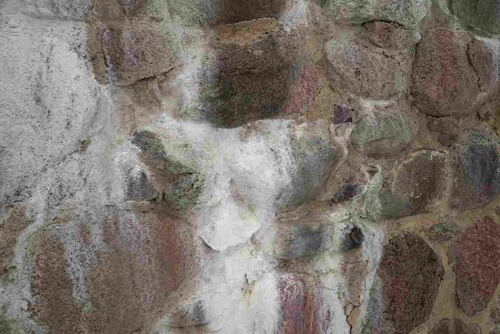

- **Archetype**: Stone Rubble Masonry (Fieldstone Wall)
- **Location & Material**: Karnataka, India / International — Glacial fieldstone bedded in cement-lime mortar.
- **Flaw Classification**: **Severe Lime Run-off & Sub-Surface Cryptoflorescence** `[Critical Risk]`
- **Clinical Pathology & Mechanics**: Uncured mortar subjected to heavy water percolation leaches soluble calcium hydroxide $\text{Ca(OH)}_2$, carbonating down the face into hard, insoluble calcite ($\text{CaCO}_3$) crusts. Internal salt crystallization within stone pores exceeds 50 MPa tensile resistance.
- **Tolerances**: Zero calcite encrustation; pore salt expansion `<1mm` pitting.
- **Remedial Action**: Apply controlled ammonium carbonate or mild sulfamic acid poultices; install coping overhang with 50mm drip throating; repoint joints with breathable lime mortar.
- **Euro (€) Benchmark Rate**: **€55 – €95 / linear meter**
- **Student Assessment Task**:
  - *Task*: Mark the cascading calcite encrustation zone.
  - *Target Coordinates*: `[x_min: 0.25, y_min: 0.10, x_max: 0.68, y_max: 0.92]`
  - *Question*: Differentiate powdery efflorescence from insoluble calcium carbonate crusts.
- **Industry Citations**: **BS 8221-1** &bull; **UltraTech Advisory** &bull; **RICS CR3**

---

### Specimen 08: Stone Boundary Wall: Missing Through-Stones & Wythe Disconnection
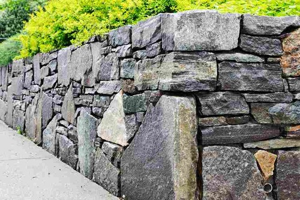

- **Archetype**: Stone Rubble Masonry (Boundary Walling)
- **Location & Material**: Maharashtra, India / International — Irregular rubble boundary wall with quoin dressings.
- **Flaw Classification**: **Absence of Transverse Through-Stones (Bond Stones)** `[Critical Risk]`
- **Clinical Pathology & Mechanics**: Double-wythe rubble wall built without transverse bond stones (headers) extending across the wall thickness. Internal rubble core infill exerts unconstrained lateral hydrostatic and gravity pressure, buckling outer wythes.
- **Tolerances**: Through-stones required at `1.5m` horizontal and `0.6m` vertical spacing, extending $\ge 75\%$ through wall.
- **Remedial Action**: Install mechanical transverse tie rods or stainless steel stitch anchors through the wall core; reconstruct localized bulging wythes with through-stones.
- **Euro (€) Benchmark Rate**: **€280 – €550 / m² rebuild**
- **Student Assessment Task**:
  - *Task*: Pinpoint the outer wythe buckling zone lacking transverse ties.
  - *Target Coordinates*: `[x_min: 0.12, y_min: 0.15, x_max: 0.65, y_max: 0.85]`
  - *Question*: Formulate through-stone layout rules and calculate required bond stone density per square meter.
- **Industry Citations**: **IS 1597 (Part 1)** &bull; **BRE GBG 14** &bull; **CIRIA C599**

---

## 3. Dressed Ashlar Freestone & Civic Classical (Specimens 09 – 11)

### Specimen 09: Georgian Ashlar Limestone Portico

- **Archetype**: Ashlar Stone (Finely Dressed Civic Masonry)
- **Location & Material**: Dublin, Ireland — Georgian Leinster Granite & Portland freestone blocks.
- **Flaw Classification**: **Sedimentary Bedding Exfoliation & Face Spall** `[Critical Risk]`
- **Clinical Pathology & Mechanics**: Ashlar stone blocks mistakenly installed with bedding planes vertical and parallel to the face (*face-bedded*). Vertical compressive point loading shears the stone along natural sedimentary foliation planes.
- **Tolerances**: Out-of-plane step `<1.0mm`; face exfoliation depth `0mm`.
- **Remedial Action**: Pneumatically dress back loose spalling lamina to sound stone; cut neat orthogonal rectangular pocket with 1:1 dovetail key; piece in matching natural-bedded freestone indent secured with non-ferrous dowels.
- **Euro (€) Benchmark Rate**: **€280 – €550 / square meter stone indent repair**
- **Student Assessment Task**:
  - *Task*: Pinpoint the face-bedded delamination fault plane.
  - *Target Coordinates*: `[x_min: 0.28, y_min: 0.30, x_max: 0.78, y_max: 0.78]`
  - *Question*: Explain the difference between naturally-bedded, face-bedded, and joint-bedded stone installation.
- **Industry Citations**: **Historic England Practical Conservation: Stone** &bull; **BS 8298**

---

### Specimen 10: Sedimentary Stone: Face-Bedding Delamination
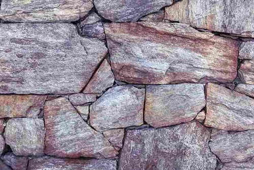

- **Archetype**: Ashlar Stone (Precision Dressed Masonry)
- **Location & Material**: Madhya Pradesh, India / International — Stratified sedimentary sandstone bedded in lime mortar.
- **Flaw Classification**: **Face-Bedding Orientation & Laminae Delamination** `[Critical Risk]`
- **Clinical Pathology & Mechanics**: Sedimentary stone units installed with natural quarry bedding planes oriented vertically parallel to the wall face (*face-bedded*) rather than horizontally perpendicular to compressive loads.
- **Tolerances**: Face exfoliation `0mm` (face-bedding prohibited in load-bearing masonry).
- **Remedial Action**: Dress back loose spalling sheets to sound stone; piece in matching freestone indent units bedded strictly on their natural quarry bed; anchor with non-ferrous dowels.
- **Euro (€) Benchmark Rate**: **€280 – €550 / m² indent**
- **Student Assessment Task**:
  - *Task*: Pinpoint the face-bedding cleavage fracture plane.
  - *Target Coordinates*: `[x_min: 0.20, y_min: 0.12, x_max: 0.88, y_max: 0.76]`
  - *Question*: Explain the catastrophic failure mode of face-bedded sedimentary stone under axial load per IS 1124 / BS 8298.
- **Industry Citations**: **IS 1124** &bull; **BS 8298** &bull; **UltraTech Masonry Guide**

---

### Specimen 11: Exposed Porous Stone: Critical Frost Attack & Ice Wedging
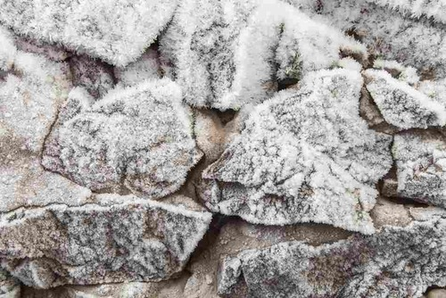

- **Archetype**: Ashlar Stone (Exposed Parapet & Wall Head)
- **Location & Material**: Himachal Pradesh, India / International — High-porosity sandstone walling subjected to sub-zero freeze-thaw cycles.
- **Flaw Classification**: **Freeze-Thaw Ice Wedging & Stone Face Spalling** `[Critical Risk]`
- **Clinical Pathology & Mechanics**: Porous stone masonry saturated beyond critical threshold (>91% pore water capacity) undergoes freeze-thaw cycles. The 9% volumetric expansion of freezing water exerts hydraulic bursting pressure that wedges joints apart and blows off outer stone faces.
- **Tolerances**: Critical threshold exceeded when pore saturation exceeds 90% or joint dilation $>5\text{mm}$.
- **Remedial Action**: Provide projecting weatherings and copings with 50mm overhangs; replace shattered blocks with Category F1 freeze-thaw resistant stone; repoint with breathable NHL 3.5 lime mortar.
- **Euro (€) Benchmark Rate**: **€280 – €550 / m² rebuild**
- **Student Assessment Task**:
  - *Task*: Locate the cryo-hydraulic ice wedging and surface spall zone.
  - *Target Coordinates*: `[x_min: 0.15, y_min: 0.12, x_max: 0.85, y_max: 0.88]`
  - *Question*: Explain the 91% critical saturation threshold in cryogenic masonry failure per EN 12371.
- **Industry Citations**: **EN 12371** &bull; **IS 1121** &bull; **UltraTech Cold-Weather Masonry**

---

## 4. Dry Stone & Gravity Walling (Specimens 12 – 16)

### Specimen 12: Traditional Irish Dry Stone Boundary

- **Archetype**: Traditional Dry Stone (Double-Faced Field Boundary)
- **Location & Material**: Galway (Aran Islands), Ireland — Karst limestone slabs without mortar.
- **Flaw Classification**: **Coping Capstone Dislodgement & Core Hearting Exposure** `[Moderate Risk]`
- **Clinical Pathology & Mechanics**: Top row of upright coping stones unseated by livestock rubbing and coastal wind gusts. Loss of the coping removes top clamping weight, leaving loose core packing stones exposed to rain washout.
- **Tolerances**: Coping stones must be continuous; unseated gap `<0.5m`.
- **Remedial Action**: Relay heavy flat and buck-and-doe coping stones; drive triangular stone wedges tightly into joints to lock copings in compression without mortar.
- **Euro (€) Benchmark Rate**: **€50 – €90 / linear meter**
- **Student Assessment Task**:
  - *Task*: Identify the gap of missing and displaced coping capstones.
  - *Target Coordinates*: `[x_min: 0.15, y_min: 0.08, x_max: 0.45, y_max: 0.32]`
  - *Question*: Explain the structural role of coping stones in compressing the underlying double-faced wythes.
- **Industry Citations**: **DSWA Master Craftsman Codes** &bull; **Irish Heritage Council**

---

### Specimen 13: Double-Faced Field Boundary
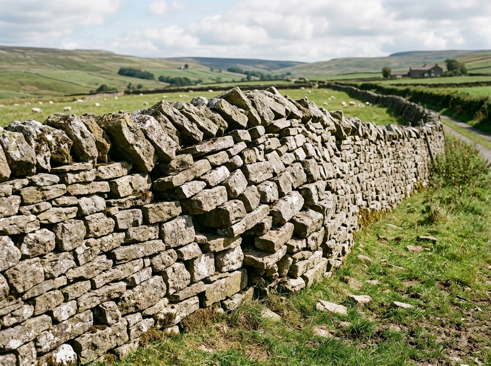

- **Archetype**: Traditional Dry Stone (Double-Faced Gravity Wall)
- **Location & Material**: Yorkshire Dales, UK — Carboniferous sandstone fieldstone.
- **Flaw Classification**: **Out-of-Plumb Lateral Wythe Bulge** `[Critical Risk]`
- **Clinical Pathology & Mechanics**: The face stones have pushed outward into an unsightly barrel bulge exceeding 25mm. Absence of transverse through-stones allowed core hearting settlement to exert outward lateral thrust against the outer wythe.
- **Tolerances**: Lateral bulge tolerance `<15mm`; batter angle must maintain `1:6` inward slope.
- **Remedial Action**: Dismantle bulged section down to solid foundation course; hand-sort stones; rebuild with inward 1:6 batter; install through-stones spanning the full wall thickness every 1m horizontal and vertical.
- **Euro (€) Benchmark Rate**: **€220 – €480 / linear meter rebuild**
- **Student Assessment Task**:
  - *Task*: Measure lateral bulge displacement and delineate unstable zone.
  - *Target Coordinates*: `[x_min: 0.40, y_min: 0.35, x_max: 0.78, y_max: 0.75]`
  - *Question*: Define through-stone spacing rules and explain why gravity friction fails once bulge exceeds 15mm.
- **Industry Citations**: **DSWA Technical Standards** &bull; **RICS CR3**

---

### Specimen 14: Aran Karst Limestone Wall
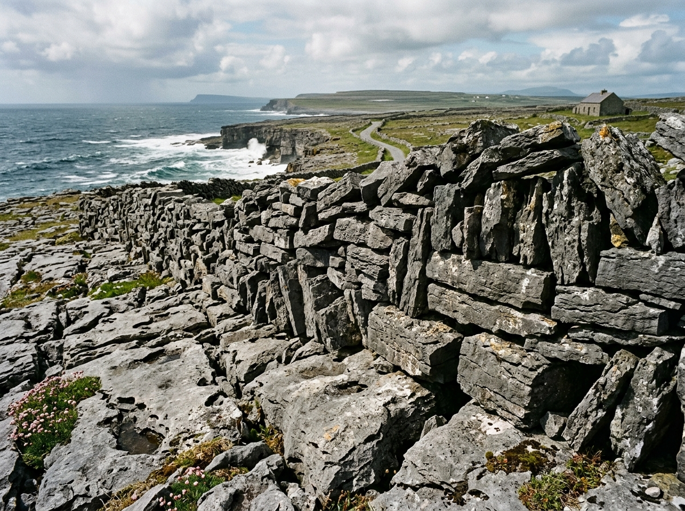

- **Archetype**: Traditional Dry Stone (Single-Wythe Karst Lace Wall)
- **Location & Material**: Inis Mór, Aran Islands, Ireland — Karst limestone slabs.
- **Flaw Classification**: **Differential Base Subsidence & Ground Creep** `[Moderate Risk]`
- **Clinical Pathology & Mechanics**: Basal footing stones resting on thin coastal peat have shifted due to peat degradation and storm washout, causing courses to dip and creating stepped shear cracks through the interlocked stones.
- **Tolerances**: Foundation dip `<20mm/m`; out-of-plumb `<15mm`.
- **Remedial Action**: Lift affected section; clear soft soil to solid limestone bedrock; bed heavy flat footing stones; re-chink base joints with sharp limestone wedges.
- **Euro (€) Benchmark Rate**: **€220 – €480 / linear meter**
- **Student Assessment Task**:
  - *Task*: Locate dipped footing course.
  - *Target Coordinates*: `[x_min: 0.20, y_min: 0.40, x_max: 0.80, y_max: 0.85]`
  - *Question*: Formulate foundation preparation rules over karstic limestone pavements.
- **Industry Citations**: **Irish Heritage Council Guidelines** &bull; **DSWA**

---

### Specimen 15: Mountain Pasture Boundary

- **Archetype**: Traditional Dry Stone (Upland Boundary Wall)
- **Location & Material**: Mourne Mountains, Northern Ireland — Granitic erratic rubble.
- **Flaw Classification**: **Total Structural Shear Collapse (Breach Gap)** `[Critical Risk]`
- **Clinical Pathology & Mechanics**: Uncorrected lateral bulging exceeded frictional shear equilibrium during torrential storm runoff. Face stones collapsed outward, spilling core hearting and causing total structural breach.
- **Tolerances**: Full structural failure (hazard to livestock and pedestrians).
- **Remedial Action**: Clean collapsed debris 1.5m to either side; excavate foundation trench; rebuild foundation courses with heavy footings; rebuild double-faced wall with dense hearting and tie through-stones.
- **Euro (€) Benchmark Rate**: **€280 – €550 / square meter complete rebuild**
- **Student Assessment Task**:
  - *Task*: Mark the full breach zone from sound cheek to sound cheek.
  - *Target Coordinates*: `[x_min: 0.25, y_min: 0.20, x_max: 0.75, y_max: 0.80]`
  - *Question*: Describe how "cheek ends" are framed during temporary gap closure.
- **Industry Citations**: **DSWA Master Craftsman Standards** &bull; **RICS CR3**

---

### Specimen 16: Highland Retaining Dyke
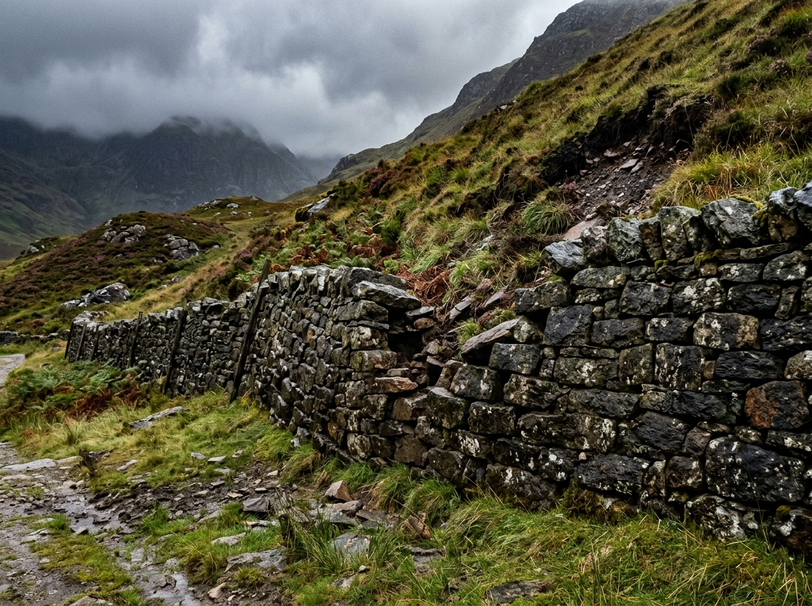

- **Archetype**: Traditional Dry Stone (Slope Revetment Dyke)
- **Location & Material**: Scottish Highlands — Dalradian schist gravity retaining wall.
- **Flaw Classification**: **Slope Surcharge & Inward Batter Loss** `[Critical Risk]`
- **Clinical Pathology & Mechanics**: Saturated hillside soil has exerted lateral surcharge against unmortared dry stone backing, rotating the wall face outward and destroying the designed 1:6 inward batter angle.
- **Tolerances**: Out-of-plumb forward lean `<20mm/m`; batter must tilt toward the retained hill.
- **Remedial Action**: Excavate retained soil 1.0m back from wall; dismantle shifted dyke; rebuild with pronounced 1:4 batter; backfill with free-draining angular crushed aggregate (40mm clean stone) wrapped in non-woven geotextile filter.
- **Euro (€) Benchmark Rate**: **€350 – €600 / linear meter**
- **Student Assessment Task**:
  - *Task*: Measure loss of inward batter slope.
  - *Target Coordinates*: `[x_min: 0.30, y_min: 0.30, x_max: 0.75, y_max: 0.80]`
  - *Question*: Contrast drainage permeability of unmortared stone retaining dykes against unwept concrete retaining walls.
- **Industry Citations**: **CIRIA C760** &bull; **Eurocode 7 (EN 1997)** &bull; **DSWA**

---

## 5. Retaining Walls & Cob Earth (Specimens 17 – 18)

### Specimen 17: Roadside Granite Retaining Wall
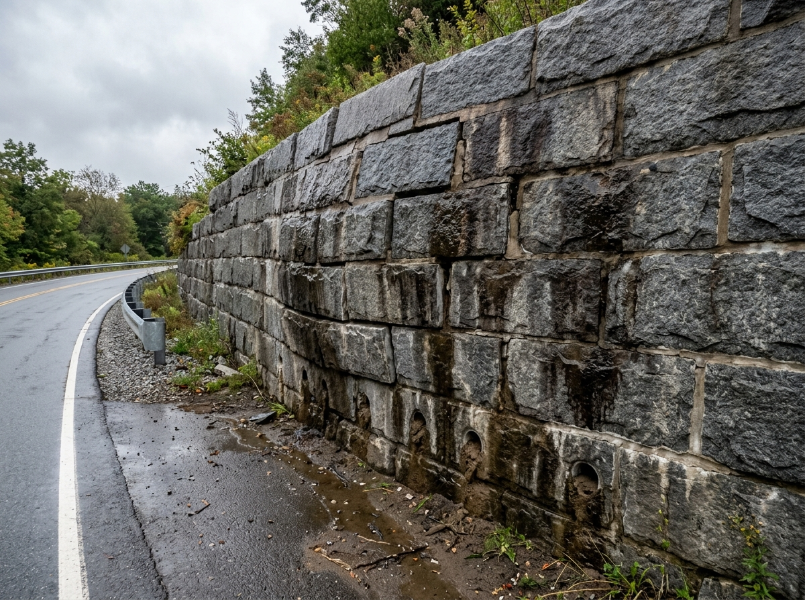

- **Archetype**: Retaining Wall (Gravity Retaining Structure)
- **Location & Material**: Galway, Ireland — Porphyritic granite blocks with drainage weeps.
- **Flaw Classification**: **Hydrostatic Outward Bulge & Weep Hole Siltation** `[Critical Risk]`
- **Clinical Pathology & Mechanics**: Silt, root growth, and calcification have blocked low-level weep tubes. Trapped groundwater generates lateral hydrostatic pore-water pressure, forcing mid-height stone courses outward.
- **Tolerances**: Hydrostatic head behind wall: `0mm` (must remain free draining); out-of-plumb `<25mm/m`.
- **Remedial Action**: Diamond core-drill new 100mm weep relief holes at 1.5m centers with 5-degree downward fall; install perforated PVC weep liners with geotextile filter socks; install tell-tale crack monitors.
- **Euro (€) Benchmark Rate**: **€65 – €110 / weep station**
- **Student Assessment Task**:
  - *Task*: Identify weep blockage signs and bulging contour.
  - *Target Coordinates*: `[x_min: 0.28, y_min: 0.35, x_max: 0.75, y_max: 0.85]`
  - *Question*: Calculate the increase in lateral thrust when soil backfill transitions from dry to fully saturated state.
- **Industry Citations**: **CIRIA C760 Embedded Retaining Walls** &bull; **Eurocode 7**

---

### Specimen 18: Vernacular Cob Cottage Wall
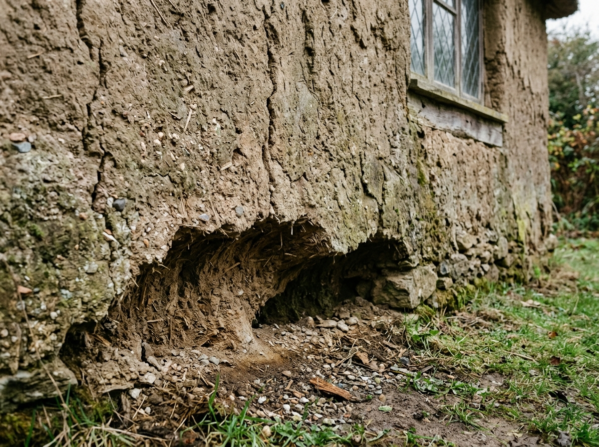

- **Archetype**: Cob & Earth (Monolithic Mass Earth Structure)
- **Location & Material**: Wexford, Ireland — Subsoil clay, sharp sand, chopped barley straw and uncalcined lime.
- **Flaw Classification**: **Basal Rain-Splash Undercut & Desiccation Fissures** `[Critical Risk]`
- **Clinical Pathology & Mechanics**: Rain splashing from hard ground level has eroded the unprotected bottom 600mm into a deep concave notch. Summer drought has caused vertical desiccation cracks through the unreinforced mass earth.
- **Tolerances**: Undercut depth `<40mm`; vertical fissure width `<3mm`.
- **Remedial Action**: Shore roof timbers; underpin eroded base with stone plinth ("good boots and a good hat"); stitch fissures with hazel ties; ram firmly with fresh straw-clay-lime cob loaf; apply 4 coats of breathable hydraulic lime wash (NHL 2.0 with tallow).
- **Euro (€) Benchmark Rate**: **€280 – €550 / m² cob repair**
- **Student Assessment Task**:
  - *Task*: Mark the basal splash undercut zone.
  - *Target Coordinates*: `[x_min: 0.20, y_min: 0.55, x_max: 0.80, y_max: 0.90]`
  - *Question*: Explain the historic proverb "give cob a good hat and good boots" in building conservation pathology.
- **Industry Citations**: **Historic England Practical Conservation: Earth** &bull; **SPAB Q&A**

---

## 6. Specialist & Modern Wall Types (Specimens 19 – 20)

### Specimen 19: East Anglian Knapped Flint Facade
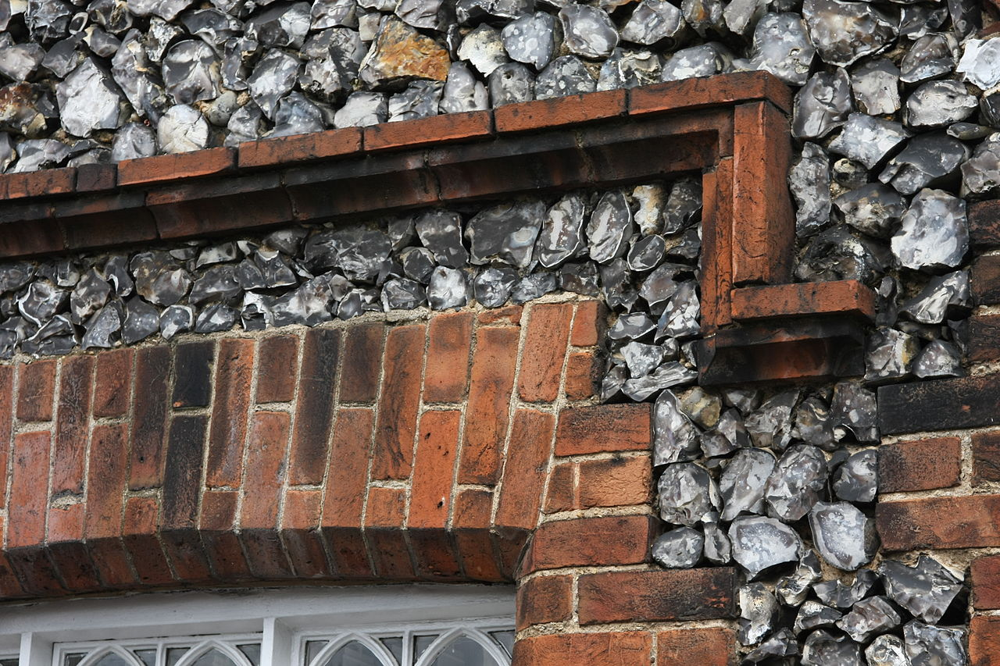

- **Archetype**: Knapped Flint & Lime Flushwork (Decorative & Protective Facing)
- **Location & Material**: Norfolk, UK — Cretaceous flint nodules bedded in chalk lime mortar.
- **Flaw Classification**: **Flint Nodule Unseating & Chalk Matrix Scour** `[Moderate Risk]`
- **Clinical Pathology & Mechanics**: Smooth, vitreous flint surfaces lack chemical suction bond with lime mortar, relying 100% on mechanical interlock. Coastal rain has scoured the soft chalk-lime matrix beyond 10mm depth, causing flint stones to pop out.
- **Tolerances**: Mortar matrix recession `<8mm`; zero unseated nodules; gallet chip loss `<10%`.
- **Remedial Action**: Rake recessed joints; re-seat fallen flint nodules into fresh hydraulic chalk lime mortar (NHL 2.0); press sharp flint gallet flakes firmly into bed joints before final set to protect matrix.
- **Euro (€) Benchmark Rate**: **€55 – €95 / linear meter repointing & galleting**
- **Student Assessment Task**:
  - *Task*: Locate loose and missing flint nodules.
  - *Target Coordinates*: `[x_min: 0.25, y_min: 0.30, x_max: 0.75, y_max: 0.75]`
  - *Question*: Explain the purpose of galleting (pressing flint chips into mortar joints) in vernacular flint masonry.
- **Industry Citations**: **SPAB Technical Advice Note: Flint Walling** &bull; **Historic England**

---

### Specimen 20: Modular Concrete Blockwork (CMU) Structural Framing
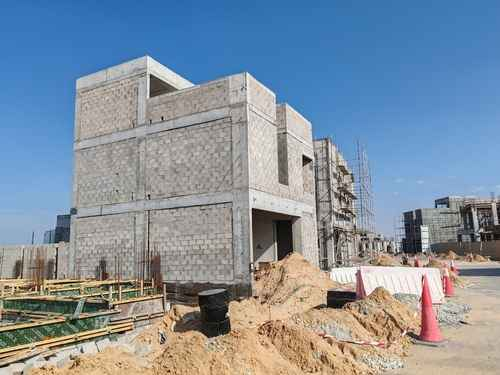

- **Archetype**: Concrete Blockwork (Modular CMU Structural Framing)
- **Location & Material**: International — Concrete masonry unit (CMU) infill panels in reinforced concrete framing.
- **Flaw Classification**: **CMU Infill Movement Joint Omission & Restrained Shear Stress** `[Moderate Risk]`
- **Clinical Pathology & Mechanics**: Multi-storey reinforced concrete framed building with concrete masonry unit (CMU) infill panels under construction. Continuous panels lack vertical contraction control joints, causing restrained drying shrinkage stress and diagonal tension cracking.
- **Tolerances**: Movement joint spacing $\le 6.0\text{m}$; crack width $<1.5\text{mm}$.
- **Remedial Action**: Diamond-saw vertical movement contraction joints every 6m; install polyethylene backing rods and UV-stable polyurethane elastomeric sealant.
- **Euro (€) Benchmark Rate**: **€45 – €80 / linear meter**
- **Student Assessment Task**:
  - *Task*: Mark the unrestrained CMU infill panel zone where movement joints were omitted.
  - *Target Coordinates*: `[x_min: 0.16, y_min: 0.15, x_max: 0.64, y_max: 0.72]`
  - *Question*: Calculate movement joint spacing per Eurocode 6 (EN 1996) and specify compressibility of backing filler.
- **Industry Citations**: **Eurocode 6 (EN 1996)** &bull; **IS 2185** &bull; **UltraTech Technical Advisory**

---

## 8. Advanced Stone Pathology & Conservation Deficiencies (Specimens 21 – 26)

### Specimen 21: Historic Sandstone: Contour Scaling
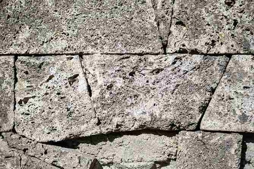

- **Archetype**: Ashlar Stone / Dressed Sandstone (Millstone Grit / York Stone)
- **Location & Material**: West Yorkshire, UK — Carboniferous quartzose sandstone ashlar.
- **Flaw Classification**: **Contour Scaling in Sandstone** `[Critical Risk]`
- **Clinical Pathology & Mechanics**: A thick (15mm–30mm) indurated crust is spalling and shearing away parallel to the outer surface contour, cutting directly across natural sedimentary quarry bedding planes. Pores blocked with calcium sulfate create differential hygrothermal movement stresses between the outer skin and parent stone core, precipitating planar cleavage detachment.
- **Tolerances**: Shell detachment depth $>10\text{mm}$; loss of arrises or profile definition $>15\%$.
- **Remedial Action**: Carefully scale away hollow delaminated crusts; surgical stone indenting with petrographically matching sandstone bedded in NHL 2.0 hydraulic lime.
- **Euro (€) Benchmark Rate**: **€320 – €620 / square meter indent**
- **Student Assessment Task**:
  - *Task*: Delineate the contour scaling shell.
  - *Target Coordinates*: `[x_min: 0.18, y_min: 0.22, x_max: 0.82, y_max: 0.78]`
  - *Question*: Explain why this flaw is frequently misdiagnosed as face-bedding and prescribe surgical stone indenting vs re-facing criteria.
- **Industry Citations**: **Historic England: Stone Practical Conservation** &bull; **BS 8298** &bull; **RICS Level 3 CR3**

---

### Specimen 22: Sheltered Limestone: Black Gypsum Crust & Cavitation (Alveolar Decay)

- **Archetype**: Ashlar Stone / Dressed Oolitic Limestone (Portland / Bath Stone)
- **Location & Material**: Central London, UK — Jurassic oolitic limestone cornices and undercut string courses.
- **Flaw Classification**: **Sheltered Gypsum Crust & Cavitation (Alveolar Decay)** `[Critical Risk]`
- **Clinical Pathology & Mechanics**: Atmospheric sulfur dioxide ($\text{SO}_2$) in urban air reacts with calcium carbonate ($\text{CaCO}_3$) to form an impermeable black gypsum ($\text{CaSO}_4 \cdot 2\text{H}_2\text{O}$) crust holding trapped soot. In rain-sheltered undercut zones, rain cannot wash away the gypsum. Sub-crust magnesium sulfate crystallization hollows out deep cavernous voids (**cavitation** / alveolar "honeycomb" decay).
- **Tolerances**: Crust thickness $>3\text{mm}$; sub-crust cavernous depth $>20\text{mm}$.
- **Remedial Action**: Nebulous low-pressure intermittent water mist spray cleaning to soften gypsum without soaking core; apply ammonium carbonate / EDTA desalinating cellulose poultices; deep cavity grouting with micronized lime.
- **Euro (€) Benchmark Rate**: **€180 – €380 / linear meter**
- **Student Assessment Task**:
  - *Task*: Map the unwashed black gypsum skin boundary and detect sub-crust hollows.
  - *Target Coordinates*: `[x_min: 0.22, y_min: 0.18, x_max: 0.80, y_max: 0.76]`
  - *Question*: Contrast the weathering behavior of limestone in rain-washed vs rain-sheltered facades.
- **Industry Citations**: **BS 8221-1** &bull; **Historic England Note 7** &bull; **RICS CR3**

---

### Specimen 23: Rubble Wall: Inappropriate Ribbon Pointing & Cement Trap Decay

- **Archetype**: Historic Lime Mortar / Uncoursed Rubble Stonework
- **Location & Material**: Wales, UK — Fieldstone rubble wall repaired with dense 1:3 Portland cement ribbon pointing.
- **Flaw Classification**: **Impermeable Ribbon Pointing & Cement Trap Decay** `[Critical Risk]`
- **Clinical Pathology & Mechanics**: Dense 1:3 Ordinary Portland Cement (OPC) mortar applied as raised 'ribbon' or 'strap' joints standing proud of the stone face. Cement shrinkage gaps draw in rainwater via capillary action, while raised ledges trap water. Impermeable mortar blocks joint evaporation, forcing all moisture out through softer stone units, causing stone crumbling and frost detachment of cement straps.
- **Tolerances**: Mortar strap projection $>5\text{mm}$; stone arris spall depth $>10\text{mm}$.
- **Remedial Action**: Carefully rake out ribbon cement mortar using non-impact oscillating diamond-tipped saws to a depth of 25mm without damaging stone arrises; repoint flush with permeable NHL 2.0 / NHL 3.5 lime mortar.
- **Euro (€) Benchmark Rate**: **€65 – €110 / linear meter**
- **Student Assessment Task**:
  - *Task*: Trace perimeter shrinkage gaps along cement ribbons and mark sacrificial stone erosion.
  - *Target Coordinates*: `[x_min: 0.16, y_min: 0.20, x_max: 0.82, y_max: 0.80]`
  - *Question*: Explain why dense Portland cement mortar acts as a destructive moisture trap when applied to softer historic stonework.
- **Industry Citations**: **SPAB Technical Advice Note: Pointing Historic Stonework** &bull; **Historic England** &bull; **RICS CR3**

---

### Specimen 24: Historic Masonry: Biogenic Cryptogamic Colonization & Acid Etching

- **Archetype**: Historic Lime / Dressed Sandstone / Copings
- **Location & Material**: Devon, UK — Dressed sandstone and lime-coursed churchyard boundary wall.
- **Flaw Classification**: **Biogenic Cryptogamic Colonization & Acid Etching** `[Moderate Risk]`
- **Clinical Pathology & Mechanics**: Heavy growth of crustose/foliose lichens coupled with thick bryophyte moss cushions along horizontal coping ledges and joint recesses. Lichens secrete chelating oxalic and lichenic acids that chemically pit limestone and calcareous sandstone. Moss pads act as moisture sponges, maintaining 100% moisture saturation that triggers winter freeze-thaw shatter.
- **Tolerances**: Biological coverage $>40\%$; moss cushion thickness $>15\text{mm}$.
- **Remedial Action**: Controlled application of quaternary ammonium compound biocides; superheated dry steam washing (ThermaTech / DOFF) at 150°C at low pressure (<40 bar) to eradicate spores without mechanical abrasion.
- **Euro (€) Benchmark Rate**: **€35 – €65 / square meter**
- **Student Assessment Task**:
  - *Task*: Distinguish between harmless aesthetic patina vs destructive oxalic etching and moss sponges.
  - *Target Coordinates*: `[x_min: 0.20, y_min: 0.20, x_max: 0.80, y_max: 0.75]`
  - *Question*: Formulate an organic biocide and steam cleaning protocol that complies with Historic England guidelines.
- **Industry Citations**: **Historic England: Biological Growths on Historic Masonry** &bull; **BS 8221-1** &bull; **RICS CR2**

---

### Specimen 25: Faunal Biodeterioration: Mason Bee Boring & Avian Guano Dissolution

- **Archetype**: Historic Lime Mortar / Porous Sandstone
- **Location & Material**: Cotswolds, UK — Historic boundary wall in soft oolitic limestone and non-hydraulic lime mortar.
- **Flaw Classification**: **Faunal Mason Bee Boring & Avian Guano Dissolution** `[Moderate Risk]`
- **Clinical Pathology & Mechanics**: Solitary mason bees (*Osmia bicornis*) bore multiple 6mm–10mm diameter cylindrical nesting galleries into soft lime mortar perpends, honeycombing the joint core. Pigeons and starlings deposit guano on copings, releasing concentrated uric and phosphoric acids that chemically dissolve calcium carbonate binders.
- **Tolerances**: Bee gallery depth $>25\text{mm}$; loss of mortar bond volume $>20\%$.
- **Remedial Action**: Flush bee boreholes with fine nozzle vacuum; syringe-inject NHL 2.0 grout to consolidate honeycomb cavities; repoint joint mouths with NHL 3.5; install non-lethal stainless-steel anti-roost deterrent wiring.
- **Euro (€) Benchmark Rate**: **€45 – €85 / linear meter**
- **Student Assessment Task**:
  - *Task*: Locate active bee nesting galleries and guano etching zones.
  - *Target Coordinates*: `[x_min: 0.22, y_min: 0.24, x_max: 0.78, y_max: 0.76]`
  - *Question*: Contrast solitary mason bee mortar boring with honeybee hive establishment in cavities.
- **Industry Citations**: **BRE Good Building Guide 14** &bull; **Historic England Invasive Fauna** &bull; **RICS CR2**

---

### Specimen 26: Victorian Plinth: Impermeable Synthetic Coating & Sealant Spalling

- **Archetype**: Ashlar Stone / Victorian Bay Window Plinths
- **Location & Material**: Edinburgh, UK — Craigleith sandstone bay window plinth coated with silicone water repellent and oil paint.
- **Flaw Classification**: **Impermeable Synthetic Coating & Sealant Spalling** `[Critical Risk]`
- **Clinical Pathology & Mechanics**: Hydrophobic silicone sealer and oil-based masonry paint applied in an ill-advised attempt to arrest rising damp. The impermeable film prevents natural vapor transpiration. Migrating moisture and dissolved salts are trapped beneath the synthetic barrier; sub-surface crypto-efflorescence crystallization pressure shears off the outer 10mm–25mm stone skin in explosive sheets.
- **Tolerances**: Blister delamination area $>0.25\text{m}^2$; stone spall depth $>15\text{mm}$.
- **Remedial Action**: Apply non-caustic latex / cellulose peel-away poultices to strip synthetic coating without abrading stone; apply sacrificial clay/paper pulp desalting packs to extract sub-surface salts; allow wall to breathe naturally.
- **Euro (€) Benchmark Rate**: **€95 – €210 / square meter**
- **Student Assessment Task**:
  - *Task*: Map delaminated coating blisters and salt crystallization blowout zones.
  - *Target Coordinates*: `[x_min: 0.18, y_min: 0.20, x_max: 0.82, y_max: 0.80]`
  - *Question*: Formulate a technical justification under the 'Breathing Wall' conservation principle explaining why synthetic sealants accelerate stone decay.
- **Industry Citations**: **BS 8221-2** &bull; **BRE Digest 245** &bull; **SPAB Breathing Wall Principle** &bull; **RICS Level 3 CR3**

---

## Student Testing & Grading Protocol

When deploying these 26 worked examples in examination mode:
1. **Visual Localization (40% Weight)**: The candidate must place an inspection reticle bounding the primary defect. Target boxes shown above define the acceptable IoU ($\ge 0.50$) intersection zone.
2. **Clinical Taxonomy (30% Weight)**: The candidate must select the precise defect nomenclature (e.g. distinguishing *Frost Spalling* from *Efflorescence*, *Bed Shear* from *Stepped Settlement*, or *Contour Scaling* from *Face-Bedding*).
3. **Remedial Specification (30% Weight)**: The candidate must specify the conservation-compliant repair method, mortar/binder chemistry, and calculate accurate Euro (€) budget estimates.

